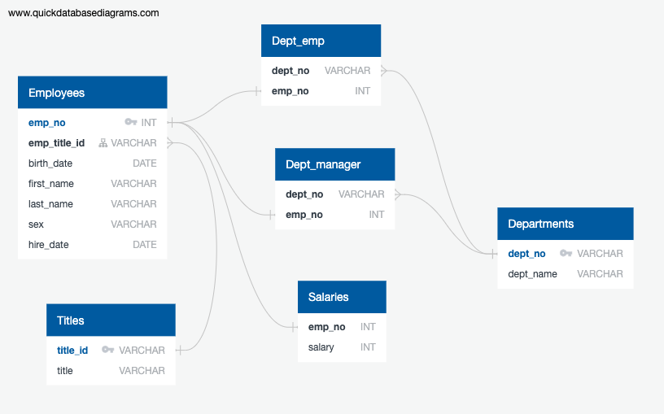
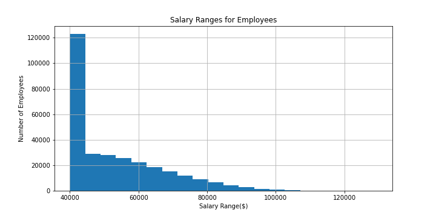
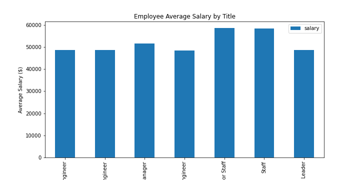

# SQL Challenge - Employee Database: A Mystery in Two Parts

## Background

It is a beautiful spring day, and it is two weeks since I have been hired as a new data engineer at Pewlett Hackard. My first major task is a research project on employees of the corporation from the 1980s and 1990s. All that remain of the database of employees from that period are six CSV files.

In this assignment, I will design the tables to hold data in the CSVs, import the CSVs into a SQL database, and answer questions about the data. In other words, I will perform:

1. Data Engineering

2. Data Modeling

3. Data Analysis

A modern word to capture all of the above activities is `analytics engineering`.

### Submission

As per instructions, the following files were created and are enclosed in the **EmployeesSQL** folder. 

1. The **data** encloses the six CSV files. 

2. The **Images** folder encloses all images: Entity Relationship Diagram (ERD) export and visualizations. 

3. The **schema.sql** file encloses the table schema for the six CSV files. 

4. The **queries.sql** file encloses eight queries providing a Data Anaylsis. 

5. The **sql_challenges_bonus.ipynb** file encloses further anaylsis of the SQL database. 

6. The **sql_challenge_ERD_export.sql** file shows documentation of the created ERD export. 

7. Finally, the **epilogue.sql** shows the searched ID number of 499942. 


### Data Modeling

The Entity Relationship Diagram (ERD) includes the database of employees, the six CSV files. To see diagram documentation, see the sql_challenge_ERD_export.sql file. 



### Data Engineering

- Table schemas were created for each of the six CSV files, where data types, primary keys, foreign keys, and other constraints were specified. See the **schema.sql** file. Each CSV file was imported into each table using pgAdmin.  

### Data Analysis

Following completion of the database, the following eight queries were created to provide data anaylsis. See the **queries.sql** file. 

1. Select the employee number, last name, first name, sex, and salary of all employees, ordered by employee number

    ```
    SELECT 
	      e.emp_no AS "Employee Number",
	      e.last_name AS "Last Name",
	      e.first_name AS "First Name",
	      e.sex As "Gender",
	      s.salary AS "Salary"
    FROM employees e
    INNER JOIN salaries s ON e.emp_no = s.emp_no
    ORDER BY e.emp_no;
    ```

2. Select the first name, last name, and hiring date for all employees hired in 1986

    ```
    SELECT
	      e.first_name AS "First Name",
	      e.last_name AS "Last Name",
	      e.hire_date AS "Hire Date"
    FROM employees e
    WHERE EXTRACT(year FROM e.hire_date) = 1986;
    ```

3. Select the department number, department name, employee number, last name, and first name of all managers of each department

      ```
      SELECT 
	        dm.dept_no AS "Department Number",
	        d.dept_name AS "Department Name",
	        dm.emp_no AS "Employee Number",
	        e.last_name AS "Last Name",
	        e.first_name AS "First Name"
      FROM dept_managers dm
      INNER JOIN departments d ON dm.dept_no = d.dept_no
      INNER JOIN employees e ON dm.emp_no = e.emp_no;

4. Select the employee number, last name, first name, and department of each employee, ordered by employee number

      ```
      SELECT 
	        e.emp_no AS "Employee Number",
	        e.last_name AS "Last Name",
	        e.first_name AS "First Name",
	        d.dept_name AS "Department Name"
      FROM employees e
      LEFT JOIN dept_emp de ON e.emp_no = de.emp_no
      LEFT JOIN departments d ON de.dept_no = d.dept_no
      ORDER BY e.emp_no;
      ```

5. Select first name, last name, birth date, and sex of all employees whose first name is "Hercules" and last name begins with a "B"

      ```
      SELECT 
        e.first_name AS "First Name",
        e.last_name AS "Last Name",
        e.birth_date AS "Date of Birth",
        e.sex AS "Gender"
      FROM employees e
      WHERE e.first_name = 'Hercules'
      AND e.last_name LIKE 'B%';
      ```

6. Select employee number, last name, first name, and department name of all employees in the Sales department, ordered by employee number

      ```
      SELECT 
        e.emp_no AS "Employee Number",
        e.last_name AS "Last Name",
        e.first_name AS "First Name",
        d.dept_name AS "Department Name"
      FROM employees e
      INNER JOIN dept_emp de ON e.emp_no = de.emp_no
      INNER JOIN departments d ON de.dept_no = d.dept_no
      WHERE d.dept_name = 'Sales'
      ORDER BY e.emp_no;
      ```

7. Select employee number, last name, first name, and department name of all employees in the 'Sales' OR the 'Development' department, ordered by employee number

      ```
      SELECT
        e.emp_no AS "Employee Number",
        e.last_name AS "Last Name",
        e.first_name AS "First Name",
        d.dept_name AS "Department Name"
      FROM employees e
      INNER JOIN dept_emp de ON e.emp_no = de.emp_no
      INNER JOIN departments d ON de.dept_no = d.dept_no
      WHERE d.dept_name IN ('Sales', 'Development')
      ORDER BY e.emp_no;
      ```

8. Count the number of employees, grouped by last name

      ```
      SELECT 
        e.last_name AS "Last Name",
        COUNT(e.last_name) AS "Number of Employees"
      FROM employees e
      GROUP BY e.last_name
      ORDER BY COUNT(e.last_name) DESC;
      ```

## Bonus (Optional)

As a bonus, I decided to take the following steps to generate a visualiation of the data. See the **sql_challenges_bonus.ipynb** file for more details. 

1. Imported the SQL database into Pandas by installing the SQLAlchemy library in my python environment and made sure to hide any sensitive information. Other libraries used were: matplotlib, os, numpy, and scipy.stats. 

2. Created a histogram to visualize the most common salary ranges for employees. The histogram shows that the data is positively skewed, indicating a large variance and standard deviation. 



3. Created a bar chart of average salary by title. The bar chart shows strange data points in that assistant engineers and engineers have similar average salaries. Also, managers make less than staff. These points seem odd in that we could expect that senior roles would have higher salaries than their subordinates, this chart shows otherwise. 



## Epilogue

As it turned out, the database was fake. But, it was a way to test the data engineering skills of a new employee. On the way out of the office, the boss said, "Search your ID number." Which is employee number 499942. See the **epilogue.sql** file which shows the searched ID number of 499942. 

## Rubric

[Unit 9 Rubric - SQL Homework - Employee Database: A Mystery in Two Parts](https://docs.google.com/document/d/1OksnTYNCT0v0E-VkhIMJ9-iG0_oXNwCZAJlKV0aVMKQ/edit?usp=sharing)

- - -

## References

Mockaroo, LLC. (2021). Realistic Data Generator. [https://www.mockaroo.com/](https://www.mockaroo.com/)

- - -

© 2021 Trilogy Education Services, LLC, a 2U, Inc. brand. Confidential and Proprietary. All Rights Reserved.